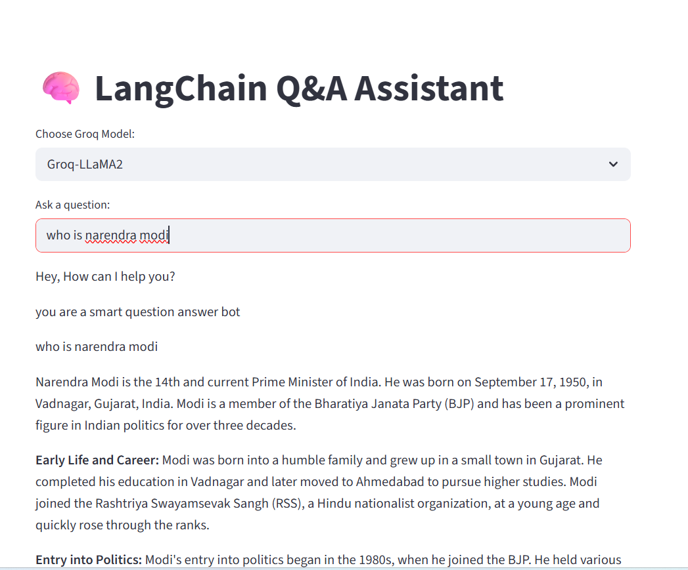

# 🧠 Groq-Powered Conversational Q&A Assistant

A conversational AI chatbot built using **Streamlit**, **LangChain**, and **Groq LLMs**, designed to deliver fast, context-aware responses with chat memory.

---

## 🌐 Live Demo

https://rachit-2006-langchain-qa-assistant-main-eihnpx.streamlit.app/

---

## 📸 Demo Preview

---

## 🚀 Features

- ⚡ Low-latency responses using Groq LLMs  
- 💬 Conversational interface with chat memory  
- 🧠 Context-aware answers using previous interactions  
- 🔄 Dynamic model selection (Groq models)  
- 🖥️ Interactive UI built with Streamlit  

---

## ⚙️ Key Technical Highlights

- Implemented conversational memory using `st.session_state`  
- Designed dynamic prompt construction using `ChatPromptTemplate`  
- Integrated Groq LLMs for high-speed inference  
- Structured chat flow using LangChain message objects (`HumanMessage`, `AIMessage`)  
- Built a modular and extensible architecture for LLM-based applications  

---

## 🛠️ Tech Stack

- Python  
- Streamlit  
- LangChain  
- Groq API  

---

